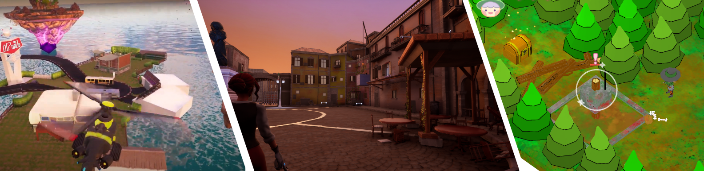
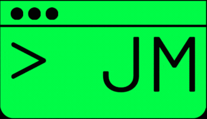

<h1 align="center">
  Hi, I'm Jose Manuel 
  
</h1>

## 🧐 About me

  I'm a <strong>Software Engineer</strong> passionate about video game development, specializing in <strong>C++ and Unreal Engine</strong>.
  
  I started my journey in game development over 3 years ago, when I began building a game engine during my third year of <strong>Multimedia Engineering</strong> at the University of Alicante. That experience sparked my passion and drove me to dive deeper into understanding how the engines behind the games I had played throughout my life really worked.

  I like bringing NPCs and game worlds to life through AI, combining technical precision with creative design.

  In my recent projects, I've focused on crafting custom <strong>AI systems</strong> — from behavior trees, blackboards, and navigation systems to AI perception frameworks — to create dynamic and engaging gameplay experiences. I also build editor tools and systems that allow designers to create engaging encounters and interactions with npcs.

  I’ve developed <strong>ECS-based game engines</strong> from scratch, emphasizing performance, scalability, and <strong>data-driven architectures</strong>. This experience deepened my understanding of how to design flexible, maintainable systems that push technical limits without sacrificing creativity.

## 🧰 Technical Skills

<table>
  <tr>
    <th>🎮 Game Engines</th>
    <th>💻 Programming Languages</th>
    <th>🔧 Version Control</th>
    <th>🌐 Web</th>
  </tr>
  <tr>
    <td align="center">
       
       
      
    </td>
    <td align="center">
       
       
        
       
       
    </td>
    <td align="center">
       
       
      
    </td>
    <td align="center">
       
       
       
       
       
       
      
    </td>
  </tr>
</table>

##  Featured Projects

## ☂️🧙‍♂️👹 Team Projects
<table style="width:100% border-collapse:separate; border-spacing:20px;">
<tr>
  <td align="center">
	
	<strong><a href="https://github.com/Josemaik/LadyUmbrella">Lady Umbrella</a></strong>
  </td>
    <td align="center">
	
	<strong><a href="https://github.com/Josemaik/TwoWonders">Two Wonders</a></strong>
	</td>
<td align="center">
	
	<strong><a href="https://github.com/Josemaik/MrOg">Mr.Og</a></strong>
</td>
</tr>
</table>

## 🛠️ Personal Projects 

<table style="width:100% border-collapse:separate; border-spacing:20px;">
<tr>
<td align="center">
	
	<strong><a href="https://github.com/Josemaik/uengine3D">ECS engine with C++ and OpenGL</a></strong>
</td>
</td>
    <td align="center">
	
	<strong><a href="https://github.com/Josemaik/uengine2D">2D Engine with C++ and litegfx</a></strong>
</td>
    <td align="center">
	
	<strong><a href="https://github.com/Josemaik/FVEngine">Custom OPP 2D Engine with C++ and Cmake</a></strong>
</td>
 </tr>
 <tr>
 <!--   <td align="center">
	
	<strong><a href="https://github.com/Josemaik/uengine3D">Cod Zombies: FPS Prototype</a></strong>
</td>
	    <td align="center">
	
	<strong><a href="https://github.com/Josemaik/uengine3D">Teapathia: Serious Game</a></strong>
</td> -->
	    <td align="center">
	
	<strong><a href="https://github.com/Josemaik/SimpleShooter">Unexpected Mission: 3D Sci-fi Shooter Prototype</a></strong>
</td>
</tr>
</table>

## 📬 Contacto | Contact

If you want to know more about me or collaborate on a project, you can find me here:

  
  
  
  
 